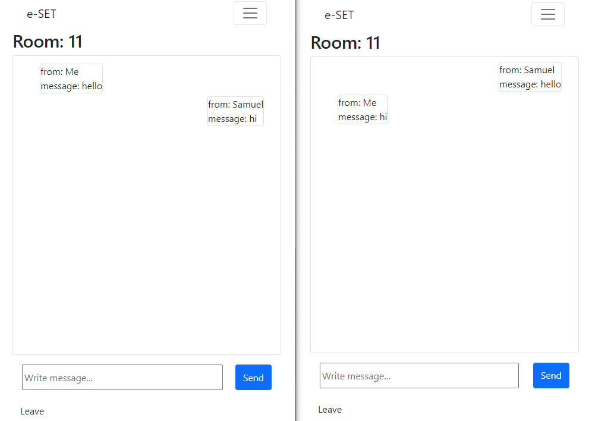

# e-SET

Original goal of the project to create multiplayer card game SET game at the moment user creation an authentication features functional as well as established real time connection between users via rooms

## Screenshots

<p align="center">
  
</p>


## Getting started

1. Clone the repo

```
git clone https://github.com/muraminsav/e-SET
```

from the terminal open the repository directory
```
cd e-SET
```
###  Run the Server

1. Install backend dependencies
From the terminal open the server directory
```
cd server 
```
```
npm install
```
2. Set up environment variables
Create .env file 
```
touch .env 
```
edit the .env file add your credentials
```
SERVER_PORT =
DB_PORT=
DB_NAME=
DB_USER=
DB_PASSWORD=
SESSION_SECRET= 
CLIENT_URL=
```
3. Run the server

```
npm start
```


3. Start development server
from the root directory
```
npm start
```


## Built with
* [React](https://reactjs.org/) - Front end library for user interface
* [React-Bootstrap](https://react-bootstrap.github.io/) - styling user interface
* [Express.js](http://expressjs.com/) - Back end library to set up 
* [Socket.io](https://socket.io/) - Used to create and maintain communication between the users
* [Sequelize](https://sequelize.org/) - ORM
* [PostgreSQL](https://www.postgresql.org/) - Relational database for user information storage
* [Express-session](https://www.tutorialspoint.com/expressjs/expressjs_sessions.htm)- Used for user authentication

## Author

David Rozsavolgyi- [Github](https://github.com/muraminsav) - [LinkedIn](https://www.linkedin.com/in/david-rozsavolgyi/)


## further feature development: 
Create game logic,
Solo game play,
Create game room,
multiplayer option,
UX/UI,


